<div align="center">

# CloudCrowd Analytics

### Edge-first crowd counting and occupancy monitoring

Detect people and movement locally, send aggregate telemetry to the cloud, and review facility status in a React dashboard.

[](https://www.python.org/)
[](https://opencv.org/)
[](https://docs.ultralytics.com/)
[](https://react.dev/)
[](https://vite.dev/)
[](https://aws.amazon.com/)

[Repository](https://github.com/Icy0077/CROWD-DENSITY-MONITOR) · [Input sources](docs/input-sources.md) · [Telemetry schema](docs/telemetry-schema.md) · [AWS pipeline](docs/aws-cloud-pipeline.md)

</div>

## Live Demo

Dashboard: [https://cloudcrowd-analytics-30d5kl99k-bmc-2ced.vercel.app](https://cloudcrowd-analytics-30d5kl99k-bmc-2ced.vercel.app)

---

## Overview

CloudCrowd Analytics is a crowd-density monitoring project. Its edge application processes camera frames, detects and tracks people, counts crossings of a virtual line, and maintains an occupancy count. It publishes aggregate telemetry through MQTT. AWS services process and store the latest facility state, and a React/Vite dashboard displays the API data.

The edge-to-cloud telemetry path sends counts and status rather than camera frames. This describes the application data flow; it is not a guarantee of privacy, anonymity, or regulatory compliance.

## Key features

- Person detection using Ultralytics YOLO and persistent ByteTrack IDs.
- Configurable virtual-line crossing to count people entering and leaving.
- Running occupancy estimate, clamped to zero.
- Multiple implemented camera and video input adapters.
- MQTT publishing, including mutual TLS configuration for AWS IoT Core.
- AWS IoT Rule, Lambda, DynamoDB, and API Gateway integration defined in CloudFormation.
- A 60-second rolling arrival-history window for the estimated queue-time proxy.
- React/Vite dashboard with occupancy, movement, proxy estimate, trend, activity, and telemetry status.
- Automated Python tests and an opt-in AWS IoT-to-API smoke test.

## Architecture

```mermaid
flowchart LR
    A[Camera or input source] --> B[Edge AI: YOLO person detection]
    B --> C[ByteTrack IDs]
    C --> D[Virtual line crossing]
    D --> E[Occupancy + IN / OUT counts]
    E --> F[Aggregate telemetry]
    F --> G[MQTT]
    G --> H[AWS IoT Core]
    H --> I[IoT Rule]
    I --> J[Telemetry Lambda]
    J --> K[(DynamoDB)]
    K --> L[API Gateway]
    L --> M[React / Vite dashboard]
```



| Layer | Responsibility |
|---|---|
| Camera/input | Supplies frames from a local or network source. |
| Edge AI | Detects people, tracks them between frames, counts line crossings, and updates occupancy. |
| MQTT/AWS IoT Core | Transports the aggregate telemetry message to the configured IoT topic. |
| Lambda | Validates and normalizes telemetry, maintains arrival history, calculates the proxy estimate, and updates facility state. |
| DynamoDB | Stores the latest state and the bounded rolling arrival history for each `location_id`. |
| API Gateway/API Lambda | Serves the latest state at `GET /telemetry/latest`. |
| React/Vite | Polls the API and renders current and last-known telemetry. |

The AWS resources and permissions are described in [`cloud/deployment/template.yaml`](cloud/deployment/template.yaml). See the [AWS pipeline guide](docs/aws-cloud-pipeline.md) for deployment prerequisites and the smoke-test procedure.

## Algorithms and queue-time estimate

### Detection, tracking, and movement

1. **YOLO** detects the person class in each frame.
2. **ByteTrack** associates detections across frames using persistent track IDs.
3. **Virtual line crossing** compares the tracked bounding-box center’s side of a configured line across observations. Crossing direction is classified as `IN` or `OUT`.
4. **Occupancy** is updated as `max(0, previous occupancy + IN - OUT)`.

The count depends on detection and tracking quality, the line placement, camera view, and reliable track continuity.

### Queue-time proxy

The dashboard’s **Estimated Queue Time (Proxy)** is an estimate derived from current occupancy and observed arrivals. It is not a measured wait for an individual and does not guarantee how long a person will wait.

The system uses two separate intervals:

- **Telemetry reporting interval:** approximately **5 seconds** in the current configuration. Each `inflow`/`outflow` count represents crossings accumulated over the configured edge reporting interval.
- **Queue observation window:** **60 seconds**. Lambda persists timestamped arrival samples in the existing DynamoDB facility item, expires samples outside the rolling window, and sums arrivals in that window.

The proxy rate and estimate are:

```text
arrival rate (people/minute) = arrivals in the 60-second window / 1 minute
estimated queue time (minutes) = current occupancy / arrival rate
```

For example, 2 people in the monitored occupancy and 5 arrivals in a complete 60-second window yield a proxy estimate of `2 / 5 = 0.4 minutes`. Fractional values are retained in storage and the numeric API response; the dashboard formats them for display.

A newly observed facility, or one without sufficient uninterrupted history, can have `estimated_wait_minutes` equal to `0` until the window is established. Zero is also returned for zero occupancy or no arrivals in a complete window. The numeric API field therefore does not distinguish all zero-estimate cases. Arrival volume is only a proxy for service rate; this is not a per-person join-to-service measurement.

## Technologies

| Area | Technologies |
|---|---|
| Edge/runtime | Python, OpenCV, NumPy |
| Computer vision | Ultralytics YOLO, ByteTrack, PyTorch |
| Input and movement | OpenCV capture adapters, tracked line-crossing logic |
| Messaging | Paho MQTT |
| Cloud | AWS IoT Core, AWS Lambda, DynamoDB, API Gateway, CloudFormation |
| Dashboard | React, JavaScript/JSX, Vite, CSS |
| Testing | pytest, Python `compileall`, Vite production build |

Python dependencies are listed in [`requirements.txt`](requirements.txt); frontend dependencies and scripts are in [`frontend/package.json`](frontend/package.json).

## Supported input sources

The input factory implements the following adapters. Availability depends on the device, OpenCV/FFmpeg build, and source URL.

| Input | Implementation and limitation |
|---|---|
| Webcam | Local OpenCV camera index; defaults to index `0`. |
| USB camera | OpenCV camera index. |
| Local video file | Supported media extensions include MP4, AVI, MOV, MKV, WEBM, and MJPEG. |
| RTSP/CCTV | RTSP or RTSPS source, subject to network and OpenCV/FFmpeg support. |
| Wi-Fi/IP camera | Compatible HTTP/HTTPS stream, including MJPEG where provided by the camera. |
| Phone | Adapter exists; browser/WebRTC signaling and media delivery are not implemented as an end-to-end video input. A phone source requires a supported configured transport such as RTSP/HTTP. |
| Bluetooth | Discovery/control metadata only; does not provide camera video. |

Source configuration and additional limitations are documented in [`docs/input-sources.md`](docs/input-sources.md).

## Local setup

Commands below use Windows PowerShell. Use a Python version compatible with the installed dependencies and a recent Node.js/npm installation.

```powershell
git clone https://github.com/Icy0077/CROWD-DENSITY-MONITOR.git
cd CROWD-DENSITY-MONITOR

python -m venv .venv
.\.venv\Scripts\Activate.ps1
python -m pip install -r requirements.txt

Copy-Item .env.example .env
Copy-Item frontend\.env.example frontend\.env.local

Set-Location frontend
npm install
npm run dev
```

The dashboard requires `VITE_API_BASE_URL` (API base URL) and `VITE_FACILITY_ID` in `frontend/.env.local` to connect to a deployed API. `VITE_EDGE_CONTROL_URL` is used by the input/settings panel when a local edge control service is available. These are configuration values, not places for credentials or secrets.

### Run the edge

Configure `.env` with the facility ID and input settings. Set `REPORTING_INTERVAL_SECONDS` to the interval represented by the edge `inflow`/`outflow` counts; the current configuration is approximately 5 seconds. For AWS IoT publishing, provide the required `AWS_IOT_*` endpoint, client, topic, and certificate file paths. Keep certificate and private-key files outside version control.

Example for a local webcam:

```powershell
.\.venv\Scripts\python.exe -m edge.main --input-type webcam --source 0
```

Other examples:

```powershell
.\.venv\Scripts\python.exe -m edge.main --input-type usb --source 1
.\.venv\Scripts\python.exe -m edge.main --input-type file --source "C:\videos\sample.mp4"
.\.venv\Scripts\python.exe -m edge.main --input-type rtsp --source "rtsp://camera-host:554/stream"
.\.venv\Scripts\python.exe -m edge.main --input-type wifi --source "http://camera-host/stream"
```

The edge pipeline uses MQTT settings from the environment. Without AWS IoT configuration it uses the configured local MQTT broker (default `localhost:1883`); a reachable broker is required to publish successfully. For all supported source options and security notes, see [`docs/input-sources.md`](docs/input-sources.md).

### Local API

The local API server can be started for development:

```powershell
.\.venv\Scripts\python.exe -m cloud.api.local_server
```

It listens on `127.0.0.1:8000` and provides `/health` and `/telemetry/latest`. When configured without DynamoDB it may return mock values; do not treat those as live telemetry. This local server is not the deployed AWS API and does not replace the separate edge input-control service.

## AWS deployment

The CloudFormation template defines the existing AWS pipeline: an encrypted on-demand DynamoDB table, processor and API Lambda functions, scoped execution roles, an AWS IoT topic rule and Lambda permission, an IoT device policy attachment, and API Gateway GET/OPTIONS routes. The processor role requires DynamoDB `GetItem` and `PutItem` for reading rolling history and writing the latest state.

The reporting interval configured for the edge must match the CloudFormation `ReportingIntervalSeconds` parameter. The current intended value is approximately **5 seconds**. The queue observation window remains **60 seconds** and is a separate Lambda code setting.

The repository provides a package builder:

```powershell
.\.venv\Scripts\python.exe scripts\package_cloud_lambda.py --output dist\cloudcrowd-lambda.zip
```

Deploy only in an AWS account where the operator has the required IAM, S3, Lambda, and CloudFormation permissions. Use a new versioned S3 object key for deployment artifacts, and configure the existing stack with the package bucket/key, facility capacity, reporting interval, facility ID, IoT topic/client/certificate ARN, and API stage. The deployment process and smoke-test prerequisites are described in [`docs/aws-cloud-pipeline.md`](docs/aws-cloud-pipeline.md). Do not place AWS credentials, certificates, private keys, or secret values in this repository.

The public telemetry response uses these contract names:

```json
{
  "location_id": "facility-1",
  "timestamp": "2026-09-17T10:30:00Z",
  "occupancy": 12,
  "capacity": 100,
  "occupancy_percentage": 12,
  "people_in": 3,
  "people_out": 1,
  "estimated_wait_minutes": 0,
  "status": "green"
}
```

`arrival_history` is internal DynamoDB state and is not included in the API response. The timestamp above is an illustrative schema example, not a live reading. See [`docs/telemetry-schema.md`](docs/telemetry-schema.md) for field definitions.

## Frontend and Vercel

The frontend is a Vite application in `frontend/`. To build it locally:

```powershell
Set-Location frontend
npm install
npm run build
```

For a Vercel deployment, configure the project root as `frontend`, use `npm run build` as the build command, and use `dist` as the output directory. Set `VITE_API_BASE_URL` to the API base URL and `VITE_FACILITY_ID` to the facility the dashboard should request. `VITE_EDGE_CONTROL_URL` is optional and applies only when a reachable local edge control service is available. Vite variables are bundled into client-side code; never put credentials, tokens, or other secrets in them. The repository contains no Vercel deployment credentials or secrets.

The dashboard polls the latest API reading every 5 seconds without overlapping requests. It keeps the last successful response when a later request fails and marks telemetry stale; it does not fabricate replacement telemetry. Frontend headers in `frontend/public/_headers` are honored only by hosts that support that file convention; verify deployment-host behavior separately.

## Telemetry and data flow

The edge MQTT transport message uses:

```text
facility_id, timestamp, occupancy, inflow, outflow
```

Lambda maps the transport fields to the canonical API/DynamoDB contract:

| API field | Source or meaning |
|---|---|
| `location_id` | Edge `facility_id` |
| `timestamp` | UTC ISO 8601 telemetry timestamp |
| `occupancy` | Current edge occupancy count |
| `capacity` | Configured facility capacity |
| `occupancy_percentage` | Occupancy divided by capacity, rounded to an integer percentage |
| `people_in` | Edge `inflow` count for the reporting interval |
| `people_out` | Edge `outflow` count for the reporting interval |
| `estimated_wait_minutes` | Numeric queue-time proxy in minutes |
| `status` | `green`, `yellow`, or `red`, derived from occupancy percentage |

The API returns `location_id`, `people_in`, and `people_out`; it does not rename those response fields to `facility_id`, `inflow`, or `outflow`.

## Privacy and security

- Camera frames are processed in the edge application. The telemetry publisher sends counts and related aggregate fields, not video frames.
- The edge detector applies a Gaussian blur to its in-memory processed frame; this is not a guarantee of anonymization and does not establish legal compliance.
- AWS IoT mutual TLS uses certificate files supplied by runtime configuration. Keep credentials and certificate material outside the repository.
- The root `.gitignore` excludes `.env` files (except `.env.example`), common key/certificate extensions, virtual environments, build output, and Vercel local files. Review ignore rules before adding configuration artifacts.
- Do not put secrets in frontend `VITE_*` variables; those values are public in the built client.
- Review IAM scope, network exposure, API authentication, rate limiting, and deployed CORS/security settings for each environment. The presence of CloudFormation resources does not by itself establish that a deployment is secure.
- The local API server is for development and should not be exposed as a public service.

## Limitations and accuracy considerations

- Detection quality depends on camera placement, occlusion, lighting, model confidence, compute capacity, and source frame quality. This repository does not publish accuracy or FPS benchmarks.
- Line placement, crossing direction, missed detections, false tracks, and track loss can cause count errors. Occupancy is a running counter and may drift; it is not an independent count of every frame.
- The queue-time value is an aggregate proxy based on occupancy and observed arrivals. Arrivals are not necessarily the service rate, and the value is not an individual measured waiting time.
- The estimate can remain zero during startup, after gaps in telemetry history, with zero occupancy, or with no arrivals in a complete observation window.
- The phone browser/WebRTC media path is incomplete, and Bluetooth does not carry video.
- RTSP and network camera compatibility depends on network reachability and the OpenCV/FFmpeg build.
- API access controls and deployment-host behavior should be validated in the target AWS and frontend environments.

## Pros and trade-offs

| Advantages | Trade-offs |
|---|---|
| Video inference and counting run at the edge; the cloud pipeline receives telemetry rather than video. | Edge inference requires suitable hardware and camera configuration. |
| Persistent tracks support directional line-crossing counts. | Detection/tracking errors can accumulate into occupancy drift. |
| Modular input adapters support local cameras, files, and compatible network streams. | Phone browser video and Bluetooth camera transport are not end-to-end video inputs. |
| CloudFormation describes the AWS ingestion, storage, and read API resources. | AWS deployment requires correctly scoped permissions, credentials, certificates, and matching edge/cloud interval configuration. |
| Dashboard distinguishes live, stale, and unavailable telemetry. | The queue-time number is a proxy; it is not a service-time measurement. |

## Testing and project status

The current verified local test suite reports **74 passed**. Python compilation and the production frontend build have also passed.

```powershell
.\.venv\Scripts\python.exe -m compileall edge tests
.\.venv\Scripts\python.exe -m pytest -q

Set-Location frontend
npm run build
Set-Location ..
git diff --check
```

The opt-in AWS pipeline smoke test requires configured AWS IoT TLS files, AWS credentials, and the relevant deployment/test settings. Run it after completing the setup in the AWS pipeline guide:

```powershell
.\.venv\Scripts\python.exe scripts\smoke_test_aws_pipeline.py
```

The latest verified run reported:

```text
IOT_RECEIVE: PASS
LAMBDA_EXECUTION: PASS
DYNAMODB_UPDATE: PASS
API_STATE_MATCH: PASS
```

The smoke script exits successfully when all stages pass. Its current successful run does not print an additional `AWS_PIPELINE_SMOKE_TEST: PASS` line.

**Project status:** Edge detection/tracking, line-crossing telemetry, cloud ingestion/storage/API, rolling arrival history, dashboard display, and automated tests are implemented. Phone WebRTC video input remains incomplete. Queue-time estimates remain proxies with the limitations described above.

## Repository layout

```text
.
├── cloud/
│   ├── api/             # API handler and local development server
│   ├── deployment/      # AWS CloudFormation template
│   ├── dynamodb/        # Latest-state storage and arrival-history persistence
│   ├── iot/             # AWS IoT helper
│   └── lambda/          # Telemetry validation and rolling-window calculation
├── docs/                # Setup, schema, cloud pipeline, and project notes
├── edge/
│   ├── input/           # Webcam, USB, file, RTSP, Wi-Fi/IP, phone, Bluetooth adapters
│   ├── mqtt/            # MQTT publisher and telemetry transport shape
│   ├── privacy/         # In-memory frame privacy processing
│   ├── tracking/        # Tracking utilities
│   └── vision/          # Person detector and tracker configuration
├── frontend/            # React/Vite dashboard
├── scripts/             # Lambda packaging and opt-in AWS checks
├── tests/                # Python automated tests
├── .env.example          # Non-secret configuration placeholders
└── requirements.txt      # Python dependencies
```

## Project

- Repository: [Icy0077/CROWD-DENSITY-MONITOR](https://github.com/Icy0077/CROWD-DENSITY-MONITOR)
- Maintainer: [@Icy0077](https://github.com/Icy0077)
