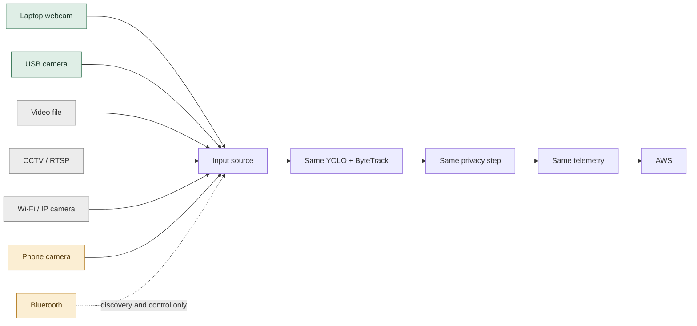

<div align="center">

# CloudCrowd Analytics

### Privacy-aware, edge-first crowd density monitoring with real-time cloud telemetry.

*See the room. Understand the flow. Keep the video at the edge.*

[](https://github.com/Icy0077/CROWD-DENSITY-MONITOR)


[](https://github.com/Icy0077/CROWD-DENSITY-MONITOR/stargazers)
[](https://github.com/Icy0077/CROWD-DENSITY-MONITOR/forks)
[](https://github.com/Icy0077/CROWD-DENSITY-MONITOR/watchers)
[](https://github.com/Icy0077/CROWD-DENSITY-MONITOR/graphs/contributors)
[](https://github.com/Icy0077/CROWD-DENSITY-MONITOR)
[](https://github.com/Icy0077/CROWD-DENSITY-MONITOR/commits)

<!-- Add project-demo.gif here after recording a real demo -->

</div>

> The star, fork, watcher, contributor, size and last-commit badges above are live GitHub counters from shields.io. Nothing is hard-coded. There is no CI workflow and no license file in the repository yet, so there are no build or license badges.

---

## The idea

CloudCrowd turns camera input into useful crowd intelligence without making the cloud carry raw video.

| 🧠 EDGE FIRST | 🔒 PRIVACY AWARE | 📡 TELEMETRY ONLY |
|---|---|---|
| Detection, tracking and counting run on the edge machine. | Privacy processing sits next to the frame source, in the same process. | The pipeline publishes derived statistics (counts, percentage, status), not frames. |

**Telemetry goes to the cloud. Raw video stays at the edge.** That is the intended data flow and the architecture of this project. It is not a guarantee of complete privacy or security.

---

## Project at a glance

| | |
|---|---|
| 🎥 **Vision** | YOLOv8n (`yolov8n.pt`) + Ultralytics ByteTrack (`bytetrack.yaml`), person class only |
| 🔐 **Privacy** | Gaussian blur step in the edge process (see [Privacy](#privacy-by-design) for exact status) |
| 📡 **Transport** | MQTT via Paho; mutual TLS when `AWS_IOT_*` variables are set |
| ☁️ **Cloud** | AWS IoT Core → Lambda → DynamoDB → API Gateway |
| 🖥️ **Dashboard** | React + Vite, polls every 5 seconds |
| 🧪 **Verification** | Frontend production build passes; Python test files are currently empty (see [Testing](#testing)) |

---

## Status legend

| Label | Meaning |
|---|---|
| ✅ **IMPLEMENTED** | Code exists in the repository |
| 🧪 **TESTED** | Verified by an automated test or a reproducible check (stated per row) |
| 🔬 **EXPERIMENTAL** | Code exists but is incomplete, unwired, or has known gaps |
| 🚧 **FUTURE-READY** | Interface or UI scaffolding only; the backend or transport is missing |
| 🗺️ **PLANNED** | Intended, nothing in the repository yet |

---

## Architecture

```mermaid
flowchart LR
    A[Camera frame] --> B[YOLOv8n person detection]
    B --> C[ByteTrack IDs]
    C --> D[Line-crossing logic]
    D --> E[Occupancy + IN / OUT]
    E --> F[Telemetry JSON]
    F --> G[MQTT over TLS]
    G --> H[AWS IoT Core]
    H --> I[IoT Rule]
    I --> J[Lambda]
    J --> K[(DynamoDB)]
    K --> L[API Gateway]
    L --> M[React dashboard]
```



| Component | What it does | In this repo |
|---|---|---|
| **Edge** (`edge/`) | Reads webcam frames, runs detection and tracking, counts line crossings, builds telemetry, publishes over MQTT. | Code |
| **AWS IoT Core** | Receives telemetry from the edge over MQTT/TLS on topic `cloudcrowd/telemetry`. | Client config only |
| **IoT Rule** | Routes messages to Lambda. | Not defined here |
| **Lambda** (`cloud/lambda/handler.py`) | Validates telemetry, recomputes wait estimate and status, writes latest state. | Code |
| **DynamoDB** (`cloud/dynamodb/database.py`) | Stores the latest state per location (partition key `location_id`). | Code (table is external) |
| **API Gateway** (`cloud/api/routes.py`) | Handler that returns the latest state for a facility. | Handler code only |
| **React** (`frontend/`) | Polls `GET /telemetry/latest?facility_id=...` and renders the report. | Code |

> The IoT Rule, API Gateway, IAM, S3 and any CloudFormation resources are configured outside this repository. There is no infrastructure-as-code in it, so the deployed AWS resources cannot be verified from the source alone.

### One pipeline. Different cameras.

The goal is for every input type to feed the same detection, tracking, privacy and telemetry path:



Green is implemented, amber is future-ready, grey is planned.

---

## Feature grid

| Feature | Status | Evidence / notes |
|---|---|---|
| Person detection | ✅ Implemented | `edge/vision/detector.py`, YOLOv8n, class 0 only, default confidence 0.25 |
| ByteTrack tracking | ✅ Implemented | Ultralytics `model.track(..., tracker="bytetrack.yaml", persist=True)` |
| IN / OUT line crossing | ✅ Implemented | Side-of-line test on box centre; `line` and `in_side` are constructor arguments |
| Occupancy | ✅ Implemented | Running counter, clamped at 0. `docs/integration-audit.md` flags possible drift under noisy tracking |
| Local privacy blur | 🔬 Experimental | Frame is blurred in memory; no toggle, no display or output uses it yet |
| MQTT publisher | ✅ Implemented | Paho, QoS 1 by default |
| MQTT over TLS to AWS IoT | ✅ Implemented | Mutual TLS via `tls_set(ca, cert, key)` when `AWS_IOT_*` is set |
| Lambda validation | ✅ Implemented | Type, range and status checks, 400 on bad input |
| DynamoDB latest state | ✅ Implemented | `put_item` / `get_item` keyed by `location_id` |
| Latest-telemetry API handler | ✅ Implemented | 200, 400 and 404 responses |
| React dashboard | ✅ Implemented · 🧪 build verified | `npm run build` succeeds |
| Connected / Stale / Disconnected states | ✅ Implemented | `App.jsx`, `SystemStatus.jsx` |
| Change-only activity and trend points | ✅ Implemented | See [Live data behaviour](#live-data-behaviour) |
| Frontend 404 page | ✅ Implemented | Client-side, for any path other than `/` |
| Input-source selector UI | 🚧 Future-ready | Calls `/input/status`, `/input/select`, `/input/devices` on an edge control server that is not in this repo |
| Phone QR pairing UI | 🚧 Future-ready | Calls `/pair/session`, `/pair-status/...` on that same missing server |
| WebRTC phone video | 🗺️ Planned | UI text mentions a signaling boundary; no media transport exists |
| RTSP / IP camera / video-file input | 🗺️ Planned | Only a local webcam index is wired in `WebcamCapture` |
| Bluetooth | 🚧 Future-ready | UI label only; see [Bluetooth](#bluetooth) |
| Edge CLI (`--source`, `--model`, ...) | 🗺️ Planned | `edge/main.py` has no argument parser and no `__main__` entry point |
| Camera HUD (FPS, IN/OUT, privacy keys 1/2) | 🗺️ Planned | No display or key handling exists in the edge code |
| 5-second edge reporting interval | 🗺️ Planned | Edge publishes once per processed frame; only the dashboard polls every 5 s |

---

## Live demo

> Add a real screen recording or GIF here.

<!-- Add project-demo.gif here after recording a real demo -->

A real demo would show: **camera → detection → tracking → local privacy → telemetry → dashboard.** There is no recording in the repository yet, so none is linked.

## Screenshots

<!-- Add screenshot: edge camera -->
<!-- Add screenshot: dashboard -->
<!-- Add screenshot: phone pairing -->
<!-- Add screenshot: AWS telemetry -->

No screenshots are committed yet.

---

## Edge computer vision

```text
Webcam frame
  ↓  YOLOv8n person detection
  ↓  ByteTrack (persistent track IDs)
  ↓  Line-crossing logic (side-of-line change between frames)
  ↓  Occupancy = max(0, occupancy + IN − OUT)
  ↓  Privacy blur (in memory)
  ↓  build_telemetry()
  ↓  MQTT publish
```

Tracking gives each person a persistent ID across frames. When a tracked centre moves from one side of the configured line to the other, it counts as IN or OUT depending on `in_side`. No model-accuracy numbers are published here because the repository contains no benchmarks.

**Performance** depends on hardware (CPU or GPU), model, inference size, camera resolution and tracking load. No FPS figure is claimed.

### Running the edge pipeline

`edge/main.py` defines an `EdgePipeline` class but no command-line entry point, so `python -m edge.main` does not start anything. To run it today, use it from Python (following the code; not executed in this review):

```python
from edge.main import EdgePipeline
from edge.vision.detector import PersonDetector

# Counting line as ((x1, y1), (x2, y2)) in pixel coordinates
detector = PersonDetector(line=((320, 0), (320, 480)), in_side="positive")

for result in EdgePipeline(detector=detector).run():
    print(result["occupancy"], len(result["detections"]))
```

The pipeline uses webcam index 0 by default and publishes through `MqttPublisher`. With no broker reachable, publishing raises an error.

---

## Privacy by design

```text
Camera frames
  ↓  local detection + privacy processing
Derived telemetry
  ↓
AWS
```

What the code does today:

- Frames are processed in memory on the edge machine. Nothing in the repository writes frames to disk or sends them to AWS.
- The telemetry payload contains only counts, percentages, a status and a timestamp (see below).
- `PrivacyDrop` applies a 35×35 Gaussian blur to the frame after detection.

What is **not** there yet:

- The blurred frame is not displayed or stored, so there is no visible privacy mode.
- There is no Privacy ON / OFF toggle (no `1` / `2` key controls) and no camera window.
- `tests/test_privacy.py` is empty, so the blur has no automated test.

This is a design direction, not a claim of anonymization or legal compliance.

---

## Live telemetry

The edge builds this payload (`edge/mqtt/publisher.py`). Values below are an example:

```json
{
  "location_id": "facility-1",
  "timestamp": "2026-10-07T10:30:00Z",
  "occupancy": 1,
  "capacity": 100,
  "occupancy_percentage": 1,
  "people_in": 1,
  "people_out": 0,
  "estimated_wait_minutes": 0,
  "status": "green"
}
```

| Field | Meaning |
|---|---|
| `location_id` | Facility identifier (from `FACILITY_ID`, default `facility-1`) |
| `timestamp` | UTC ISO 8601 time the edge generated the message |
| `occupancy` | Current tracked occupancy |
| `capacity` | Capacity used for the percentage (default 100) |
| `occupancy_percentage` | `occupancy / capacity × 100`, rounded |
| `people_in` / `people_out` | IN and OUT crossings counted in the frame that produced this message |
| `estimated_wait_minutes` | Edge sends 0; Lambda recomputes it with Little's Law as `round(occupancy / arrivals_per_minute)`, where `arrivals_per_minute = people_in / (REPORTING_INTERVAL_SECONDS / 60)`; 0 when `people_in` is 0 |
| `status` | `green` below 50%, `yellow` from 50% to 80%, `red` above 80% |

The dashboard also accepts the older names `facility_id`, `inflow`, `outflow` and `wait_time`, and shows `inflow` and `outflow` in its UI. `docs/telemetry-schema.md` is the schema reference. Its example uses `library_01`, so treat `facility-1` as this project's live facility, not the schema doc's sample.

### Live data behaviour

The dashboard polls every 5 seconds without overlapping requests. A 5-second poll does **not** mean a crowd event happens every 5 seconds. A new activity entry and trend point are added only when the returned telemetry differs from the previous reading in at least one field (the comparison includes `timestamp`). If nothing changed, the display keeps the old points instead of inventing activity.

---

## Dashboard

React + Vite, JavaScript/JSX and CSS. It shows:

- occupancy and capacity, with utilization percentage and a status line
- IN / OUT movement, estimated wait time (from the API) and a status colour
- last successful update, with **Connected / Stale / Disconnected** states
- live activity log (last 20 changes) and a client-side session trend (last 24 points)
- an input-source panel (🚧 future-ready, see above)

It uses real API telemetry. When the API fails, the last good reading is kept and marked **Stale**, and no fallback or demo data is substituted. The local development server in `cloud/api` is the exception: it can return mock data (see [Local API](#local-api)).

**Design:** editorial and information-design led. Serif type, a warm paper-like background, charcoal text, restrained green, amber and red status colours, a movement visualization and subtle animation.

---

## Input Sources

| Source | Status | Notes |
|---|---|---|
| Laptop webcam / local camera index | ✅ Implemented, hardware-dependent | OpenCV camera index, normally `0` |
| USB camera | ✅ Implemented, hardware-dependent | Another OpenCV camera index, for example `1` |
| Local video file | ✅ Implemented, hardware-dependent | Local `.mp4`, `.avi`, `.mov`, `.mkv`, `.webm`, or `.mjpeg` path |
| CCTV / RTSP | ✅ Implemented, configuration-dependent | Requires a reachable RTSP URL |
| Wi-Fi / IP camera | ✅ Implemented, configuration-dependent | Requires a reachable RTSP/HTTP/MJPEG URL |
| Phone camera | 🚧 Not video-ready | QR pairing exists, but WebRTC frame reception is not implemented |
| Bluetooth | ⚠️ Control/discovery only | Bluetooth camera video is not supported |

When `edge.main` is running, its local input-control server shares the same `InputDeviceManager` as the detection loop. A successful `POST /input/select` validates and opens the replacement source, probes a frame, then atomically swaps it into the running pipeline. A failed switch leaves the previous source in place.

### Phone QR pairing 🚧

The intended experience:

```text
Desktop: Generate QR  →  Phone scans  →  Pairing page  →  Camera permission
→  Start camera  →  Wi-Fi / WebRTC  →  Edge  →  YOLO + ByteTrack  →  AWS telemetry
```

The dashboard requests a short-lived pairing session, renders a QR code, and the local edge server provides a camera-permission page. The WebRTC signaling/media receiver that would turn the browser stream into OpenCV frames is not implemented, so Phone is not reported as an active video source.

### Bluetooth

Bluetooth is treated as discovery, pairing and control metadata only. Bluetooth camera video is not supported. Use USB, Webcam, Wi-Fi/RTSP, CCTV/RTSP, or Phone after a WebRTC receiver is added.

---

## Security

CloudCrowd follows an edge-first security model and implements practical application and infrastructure hardening. Deployments should still be reviewed for network exposure, credentials, IAM permissions, camera security and infrastructure configuration.

**Controls present in the repository**

| Area | Control |
|---|---|
| Secrets | `.env` and `.env.*` ignored (except `.env.example`); `*.pem`, `*.crt`, `*.key`, `*.p12`, `*.cert`, `*.pfx`, `*.der` ignored; `.env.example` contains only placeholders |
| AWS IoT | Mutual TLS with CA, device certificate and private key supplied by file path; all six `AWS_IOT_*` settings required together; missing certificate files fail fast |
| Cloud input validation | Lambda rejects non-object events, non-string IDs, non-numeric or negative values, zero capacity and invalid status, returning `400` |
| API behaviour | Missing `facility_id` returns `400`; unknown facility returns `404` |
| Frontend validation | Telemetry responses are checked for required fields, finite numbers and a valid timestamp before display; failures show a generic message, not internals |
| Frontend 404 | Any path other than `/` renders a 404 page |
| Frontend headers | `frontend/public/_headers` sets CSP, `X-Content-Type-Options`, `Referrer-Policy`, `Permissions-Policy`, HSTS and `Cache-Control: no-store`, honoured only on hosts that support a `_headers` file |
| Secrets in frontend | Only `VITE_*` values; the README for the frontend warns not to put credentials there |
| Privacy | No code path stores or uploads frames; telemetry is aggregate counts |

**Known gaps (current state)**

- The local dev server (`cloud/api/local_server.py`) sends `Access-Control-Allow-Origin: *`, has no authentication, and is for local testing only.
- No API authentication, rate limiting or CORS configuration for the deployed API is defined in this repository.
- The MQTT publisher defaults to plaintext `localhost:1883`. If `MQTT_USERNAME` is set without `AWS_IOT_*`, TLS is not enabled even when `MQTT_TLS=true`.
- There is no RTSP handling, so no SSRF or RTSP-credential controls exist yet. Those become relevant if network camera input is added.
- The API handler falls back to mock telemetry when `DYNAMODB_TABLE` is unset, which can hide a misconfiguration.
- `cloud/iot/device.py` reads certificate paths from `AWS_IOT_ROOT_CA`, `AWS_IOT_CERTIFICATE` and `AWS_IOT_PRIVATE_KEY`, which differ from the names used by the edge publisher.
- Dependencies are pinned in `requirements.txt`; the frontend uses `latest` for React, Vite and the React plugin. No dependency scanning is configured.

`docs/security-audit.md` and `docs/integration-audit.md` hold the project's own audit notes. They were written at different times, and some findings (for example the privacy stub) are marked fixed in one and open in the other.

---

## Error handling

| Situation | Behaviour |
|---|---|
| Unknown frontend route | Client-side 404 page with a link back to `/` |
| API `404` (no state for facility) | Error message shown; connection state follows the previous successful update |
| Malformed telemetry | Frontend shows "Telemetry response is invalid."; Lambda returns `400` |
| API unavailable | Frontend shows "Unable to load telemetry right now."; **Stale** if a previous reading exists |
| Never connected | **Connecting** while loading, then **Disconnected** |

---

## Repository structure

```text
CROWD-DENSITY-MONITOR/
├── cloud/
│   ├── api/            # Latest-telemetry handler (routes.py) and local dev server
│   ├── dynamodb/       # OccupancyStateStore (DynamoDB read/write)
│   ├── iot/            # AwsIotDevice MQTT client helper
│   └── lambda/         # Telemetry ingest + validation handler
├── docs/               # Setup notes, manual test reports, schema, audits
├── edge/
│   ├── main.py         # EdgePipeline (capture → detect → telemetry → publish)
│   ├── mqtt/           # MqttPublisher, build_telemetry
│   ├── privacy/        # PrivacyDrop (Gaussian blur)
│   ├── tracking/       # Placeholder (empty); tracking runs through Ultralytics
│   └── vision/         # PersonDetector, WebcamCapture
├── frontend/           # React + Vite dashboard
├── integration/        # pipeline_test.py (currently empty)
├── scripts/            # test_aws_iot.py: opt-in AWS IoT connectivity test
├── tests/              # test_detection / test_privacy / test_tracking (currently empty)
├── .env.example
├── .gitignore
├── requirements.txt
└── yolov8n.pt          # YOLOv8n weights
```

`edge/config/settings.py` and `cloud/api/routes.md` are also empty placeholders.

---

## Getting started

Commands are written for Windows PowerShell, which matches the project's configuration examples. The Python code itself is not Windows-specific.

```powershell
# 1. Clone
git clone https://github.com/Icy0077/CROWD-DENSITY-MONITOR.git
cd CROWD-DENSITY-MONITOR

# 2-4. Python environment and dependencies
python -m venv .venv
.\.venv\Scripts\Activate.ps1
pip install -r requirements.txt

# 5. Frontend dependencies
cd frontend
npm install
cd ..
```

**6. Configure the environment**

```powershell
Copy-Item .env.example .env
Copy-Item frontend\.env.example frontend\.env.local
```

Edge (`.env`):

```dotenv
FACILITY_ID=facility-1

AWS_IOT_ENDPOINT=<your-endpoint>
AWS_IOT_CLIENT_ID=<your-client-id>
AWS_IOT_TOPIC=cloudcrowd/telemetry
AWS_IOT_PORT=8883
AWS_IOT_CA_PATH=<path-to-root-ca>
AWS_IOT_CERT_PATH=<path-to-certificate>
AWS_IOT_PRIVATE_KEY_PATH=<path-to-private-key>
```

Frontend (`frontend/.env.local`):

```dotenv
VITE_API_BASE_URL=<your-api-gateway-base-url>
VITE_FACILITY_ID=facility-1
VITE_EDGE_CONTROL_URL=http://127.0.0.1:8000
```

`frontend/.env.example` ships with an API Gateway URL for the maintainer's `facility-1` deployment; replace it with your own. Do not put AWS keys, certificates or camera credentials in any `VITE_*` variable or in committed files.

**7. AWS IoT certificates:** create a Thing and certificate in AWS IoT Core, download the root CA, device certificate and private key, store them outside the repository and point the `AWS_IOT_*_PATH` variables at them. See `docs/aws-iot-setup.md`. To check connectivity: `python scripts/test_aws_iot.py` (opt-in; needs real AWS IoT configuration).

**8. Tests:** see [Testing](#testing).

**9. Start the edge:** see [Running the edge pipeline](#running-the-edge-pipeline).

**10. Start the frontend:**

```powershell
cd frontend
npm run dev
```

## Quick start (dashboard only)

```powershell
cd frontend
npm install
npm run dev
```

The dashboard reads from whatever `VITE_API_BASE_URL` points to. For the edge side, use the snippet in [Running the edge pipeline](#running-the-edge-pipeline).

### Local API

```powershell
python -m cloud.api.local_server
```

Serves `/health` and `/telemetry/latest` on `127.0.0.1:8000`. Without `DYNAMODB_TABLE` it returns **mock** values, so do not treat that output as live telemetry. It also uses port 8000, the same default as `VITE_EDGE_CONTROL_URL`, and it does not implement the `/input` or `/pair` routes the dashboard's input panel expects.

---

## Testing

| Check | Status |
|---|---|
| Frontend production build (`cd frontend; npm run build`) | ✅ Passes when run for this README |
| `pytest` | ⚠️ `tests/test_detection.py`, `test_privacy.py`, `test_tracking.py` and `integration/pipeline_test.py` are empty, so pytest runs no tests |
| Manual test reports | `docs/` contains dated reports for the edge pipeline, MQTT, Lambda/DynamoDB/API handlers and the frontend. They are written records, not automated tests |
| AWS IoT connectivity | `scripts/test_aws_iot.py`, opt-in and requires real credentials |

`pytest` is in `requirements.txt`, ready for tests to be added. Run `python -m pytest` after installing dependencies.

---

## Roadmap

- 🗺️ Edge CLI with `--source` and camera options
- 🗺️ Reporting interval on the edge (currently one message per processed frame)
- 🗺️ Visible privacy mode and runtime toggle
- 🗺️ RTSP, IP camera and video-file inputs behind one input-source layer
- 🚧 Edge control server for the dashboard's input panel
- 🚧 Phone QR pairing page and WebRTC media path
- 🗺️ Automated tests for detection, tracking, privacy and the end-to-end telemetry flow
- 🗺️ Infrastructure-as-code for the AWS resources
- 🗺️ CI workflow and a license

---

## Project information

- **Repository:** [github.com/Icy0077/CROWD-DENSITY-MONITOR](https://github.com/Icy0077/CROWD-DENSITY-MONITOR)
- **Clone:** `git clone https://github.com/Icy0077/CROWD-DENSITY-MONITOR.git`
- **Maintainer:** [@Icy0077](https://github.com/Icy0077)

<div align="center">

*Built for live monitoring, designed for extensibility.*

[ View on GitHub ](https://github.com/Icy0077/CROWD-DENSITY-MONITOR)

</div>
